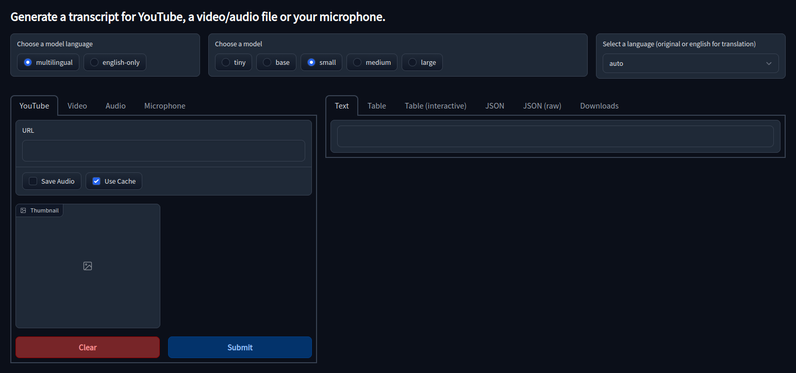

# Whisper Web UI

A browser interface based on the Gradio library for OpenAI's Whisper model.



## Features

- Transcribes videos from YouTube, a video or audio file or a recording from your microphone.
- Output
  - Text
  - Markdown with Timestamps
  - JSON with the text, start and end time
  - JSON with all parameters
  - Downloadable as file
- The system default dark theme is currently not supported in all browsers.
  - To switch to dark mode manually add `/?__theme=dark` to the end of the URL.

## Hardware Requirements

You can run this on your CPU but it is a lot slower than running it on an GPU.  
See [this](https://github.com/openai/whisper#available-models-and-languages) for the GPU hardware requirements.  
The models `tiny`, `base` and `small` should run on any hardware.

## Installation and Running

### Installation on Windows

1. Install [Python 3](https://www.python.org/downloads/windows/), checking "Add Python to PATH"
2. Install [git](https://git-scm.com/download/win)
3. Install ffmpeg
4. Reboot
5. Download this repository, for example by running `git clone ..........`.
6. (optional) To use your GPU install PyTorch manually (see [Use a GPU]())
7. Install the required Python dependencies with `pip3 install -r requirements.txt` or `pip install -r requirements.txt`
8. Copy the `.env.example` file and rename the copied file to `.env`
9. (optional) Change the parameters in the `.env` file
10. Run `py app.py`

### Installation on Linux

1. Install dependencies:
   ```bash
   # Debian-based:
   sudo apt update && sudo apt install git python3 python3-venv python3-pip ffmpeg
   # Red Hat-based:
   sudo dnf install git python3 python3-pip ffmpeg
   # Arch-based:
   sudo pacman -S git python3 python-pip ffmpeg
   ```
2. Download this repository, for example by running `git clone ..........`.
3. (optional) To use your GPU install PyTorch manually (see [Use a GPU]())
4. Install the required Python dependencies with `pip3 install -r requirements.txt` or `pip install -r requirements.txt`
5. Copy the `.env.example` file and rename the copied file to `.env`
6. (optional) Change the parameters in the `.env` file
7. Run `python3 app.py` or `python app.py`

### Use a GPU

To use it with a GPU, install Nvidia's CUDA or AMD's ROCm drivers.  
To install PyTorch with the right driver version see here: https://pytorch.org/get-started/locally/  
Example: To install PyTorch for CUDA version 11.6: `pip3 install torch torchvision torchaudio --extra-index-url https://download.pytorch.org/whl/cu116`

## Credits

- OpenAI Whisper https://openai.com/blog/whisper/, https://github.com/openai/whisper
